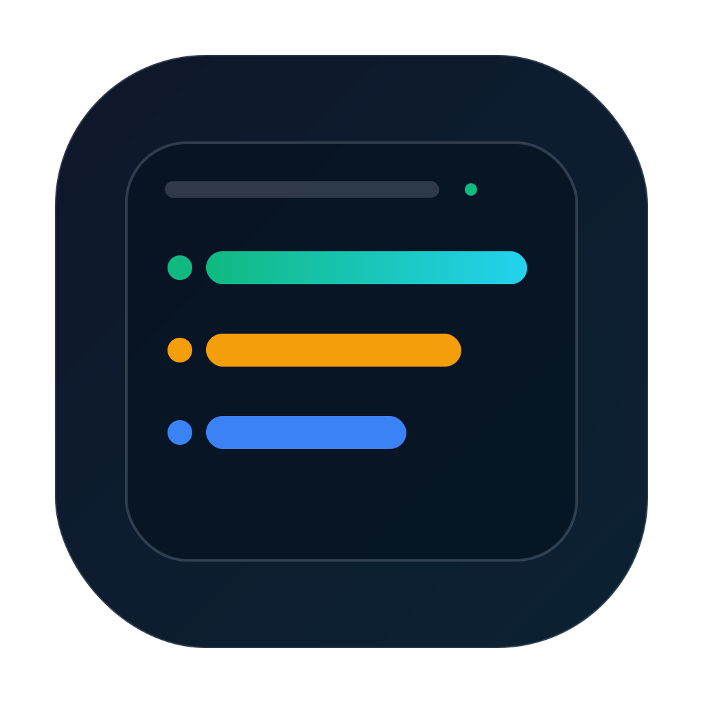
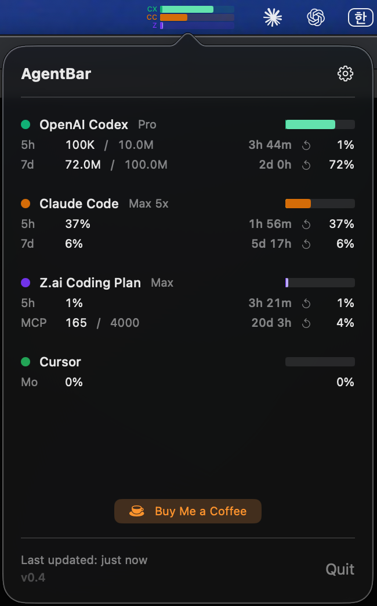

# AgentBar

<p align="center">
  
</p>

[](https://developer.apple.com/documentation/security/notarizing_macos_software_before_distribution)
[](#build)

macOS menu bar app that tracks AI coding assistant usage in one place.

<p align="center">
  
</p>

## Supported Services

| Service | Data Source |
|---------|-----------|
| Claude Code | Anthropic OAuth API (Keychain credential) |
| OpenAI Codex | Local session logs (`~/.codex/sessions/`) |
| Google Gemini | Local logs (`~/.gemini/tmp/`) |
| GitHub Copilot | GitHub Copilot API (PAT from Keychain) |
| Cursor | Cursor API + local SQLite DB |
| Z.ai | Z.ai quota API (API key from Keychain) |

## Features

- Stacked usage bar in the menu bar, sorted by usage
- Detail popover with per-service metrics
- Desktop notifications for agent events (Claude hooks, Codex watcher)
- Configurable refresh interval, per-service enable/disable
- Plan/limit controls and API key management
- Sound pack support via CESP registry
- Custom notification audio is played after notification delivery, with fallback alert tone on playback failure

## Install

Download `AgentBar.dmg` from [Releases](https://github.com/scari/AgentBar/releases), open the DMG, and drag AgentBar to Applications.

## Build

```sh
# Build & Run
xcodebuild build -project AgentBar.xcodeproj -scheme AgentBar -configuration Debug -derivedDataPath build -quiet
open build/Build/Products/Debug/AgentBar.app

# Test (recommended: serial workers, no system keychain integration tests)
./scripts/test.sh

# Optional: run with system keychain integration test enabled
AGENTBAR_RUN_SYSTEM_KEYCHAIN_TESTS=1 ./scripts/test.sh
```

Notes:
- `scripts/test.sh` defaults to `-parallel-testing-enabled NO` and worker count `1` to avoid repeated macOS security prompts.
- The system Keychain integration test is opt-in via `AGENTBAR_RUN_SYSTEM_KEYCHAIN_TESTS=1`.

## Support

[](https://github.com/sponsors/scari)
[](https://buymeacoffee.com/_scari)

## License

MIT License. See [LICENSE](LICENSE).
